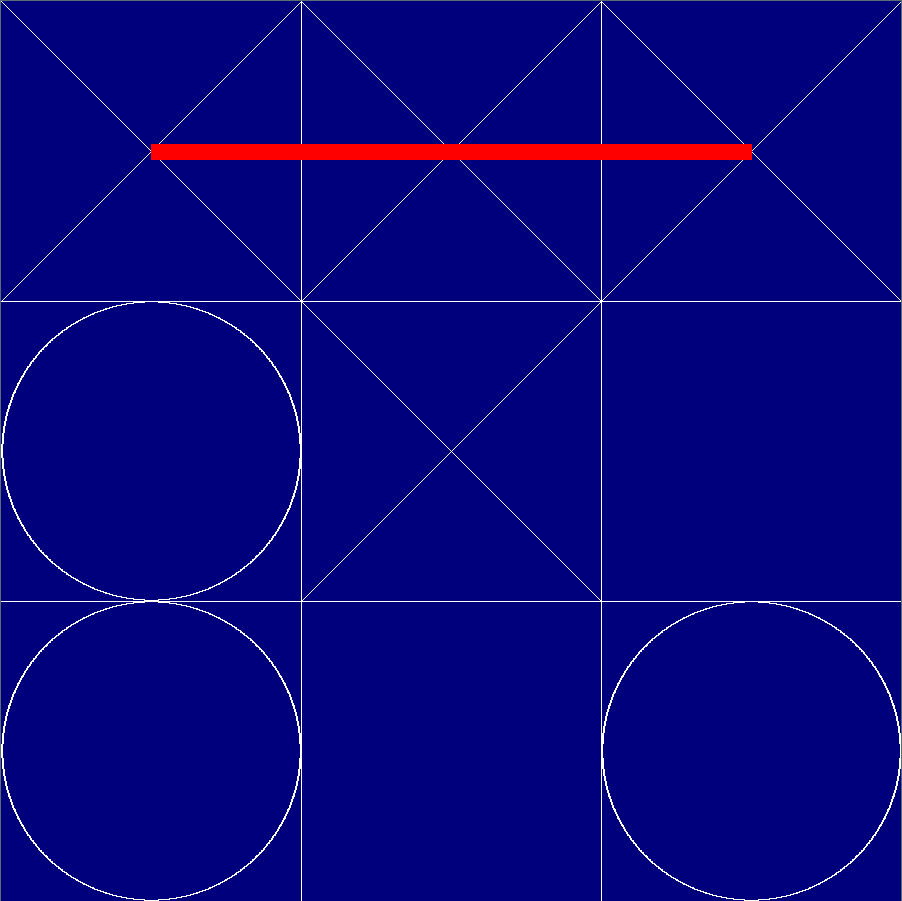

# Tic Tac Toe
# TODO change usage
A simple implementation of the `tic-tac-toe` game using pygame interface, and a minmax AI with levels to play against.

<div align="center">



</div>

## Installation
This game runs on python >= 3.6, use pip to install dependencies:
```
pip3 install -r requirements.txt
```

## Usage
Use the `play_tic_tac_toe.py` script to play the game.
```
usage: play_tic_tac_toe.py [-h] [-l LEVEL] [-p1 {human,ai}] [-p2 {human,ai}]
                           [-w WIDTH] [-t TIME]

implementation of a simple tic tac toe game

optional arguments:
  -h, --help            show this help message and exit
  -l LEVEL, --level LEVEL
                        Level of the game, concretely, this represents the
                        depth of evaluating the minmax tree
  -p1 {human,ai}, --player1 {human,ai}
                        Controler of player 1, always plays with 'X'
  -p2 {human,ai}, --player2 {human,ai}
                        Controler of player 2, always plays with 'O'
  -w WIDTH, --width WIDTH
                        Width and height of the board
  -t TIME, --time TIME  Waiting time between two consecutive games in secondes
```
